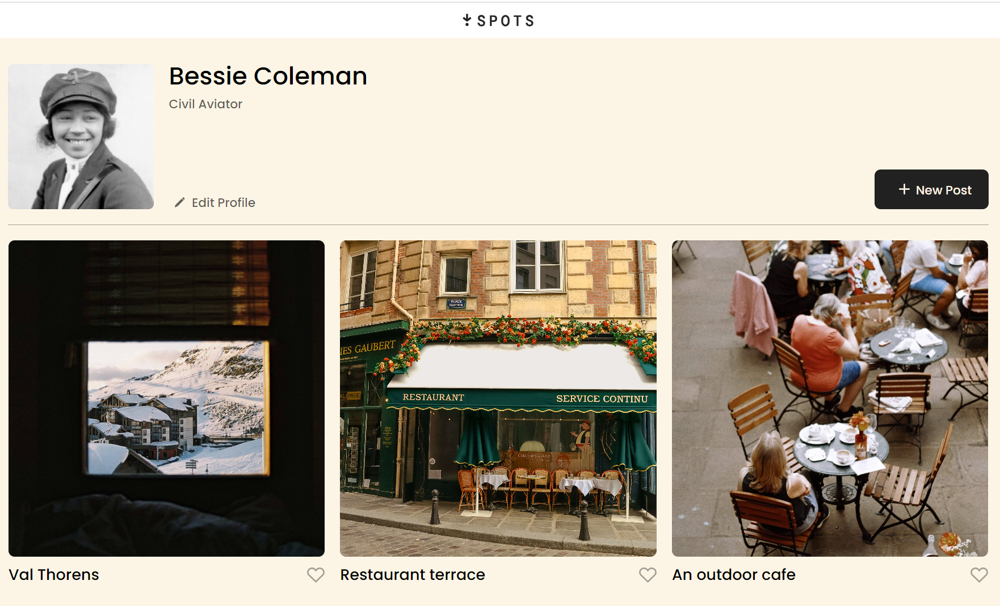
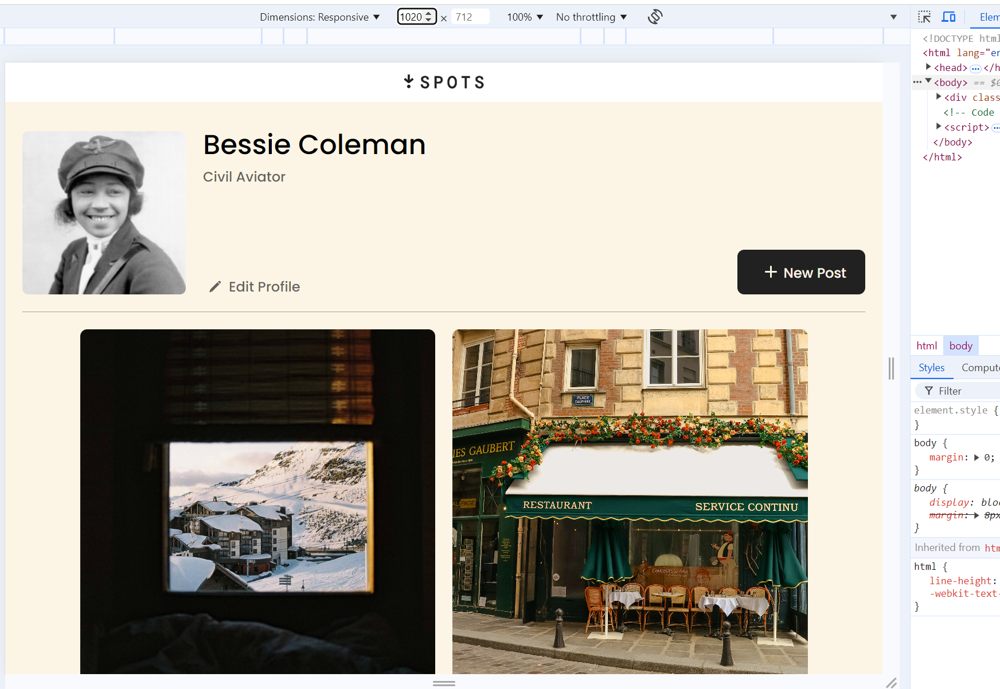
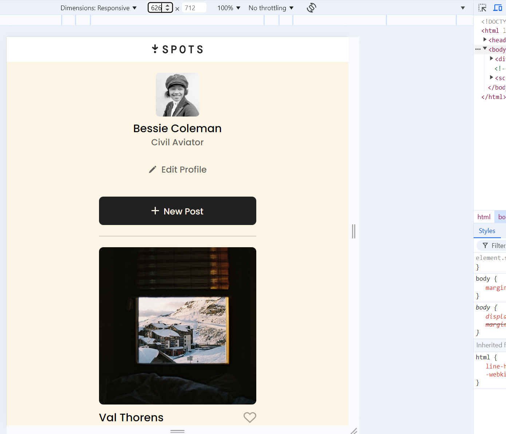

# Project 3: Spots

An image-sharing site.

## Description

The updated version of this project is meant to deploy it from a server rather than a local computer.
The original purpose of this project was to ensure all elements are displayed properly on popular screen sizes.

## Tech Stack

- Webpack
- HTML
- CSS
- Responsive design

## Images

## Deployment

This webpage is deployed to GitHub Pages.

- [Deployment link ](https://MHVXV.github.io/se_project_spots)

## Project video

Here is a video describing my project

- [Video link ](https://drive.google.com/file/d/13FDmr48qFwMGWR1CMT1BvuuFDDLHC8sD/view?usp=drive_link)
